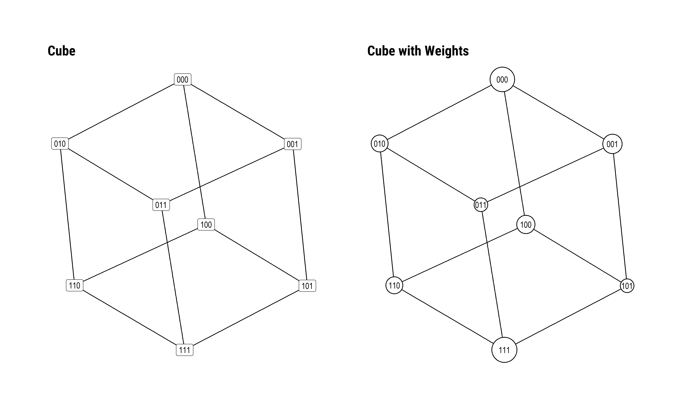
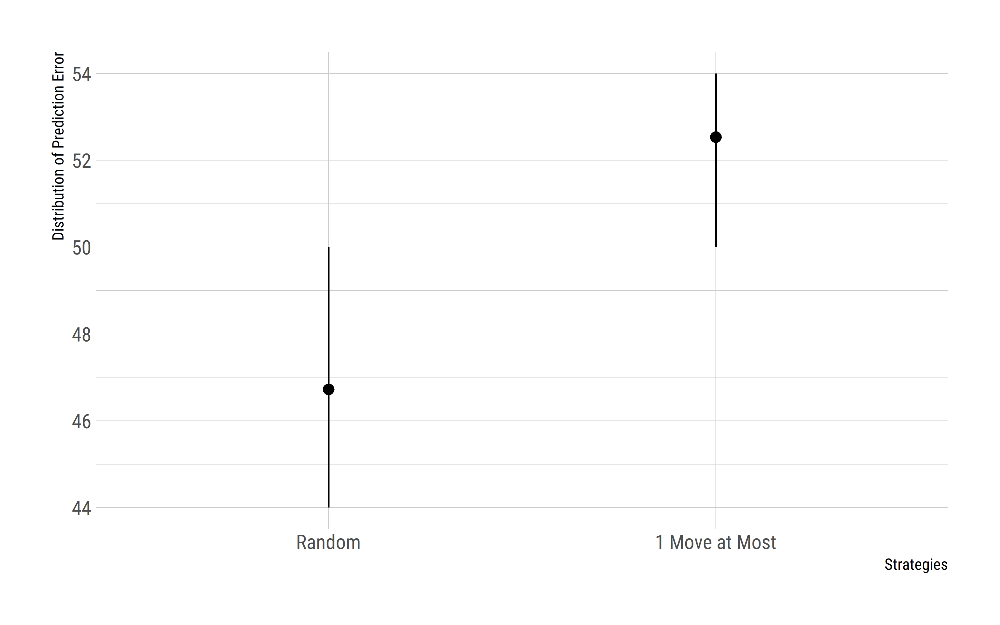
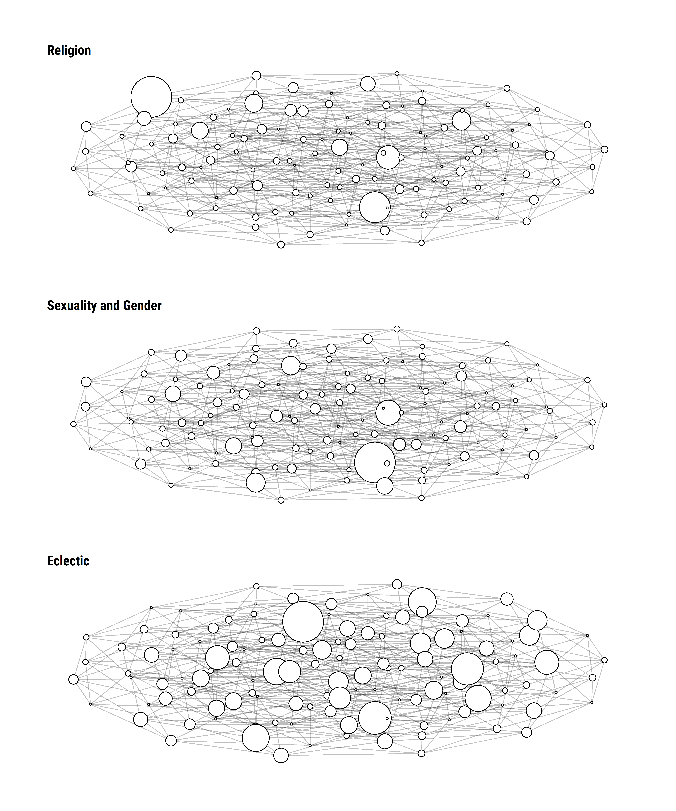
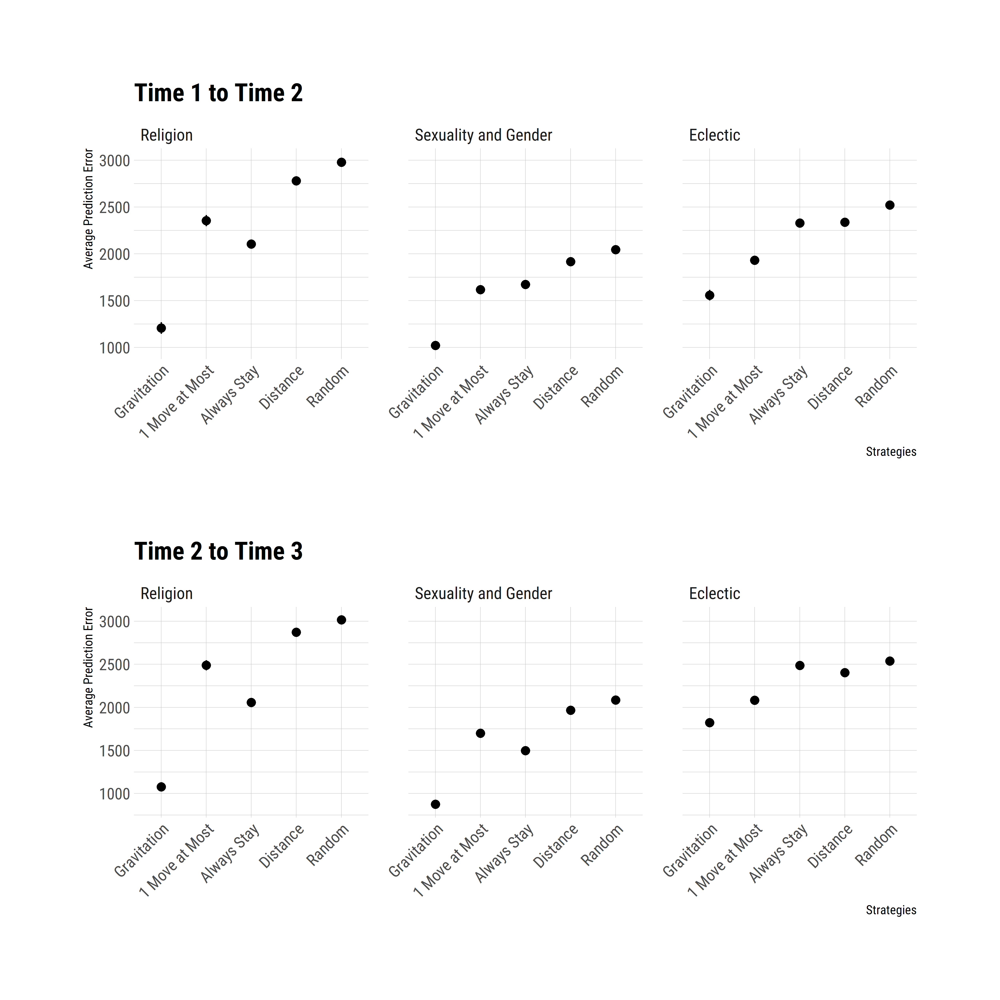
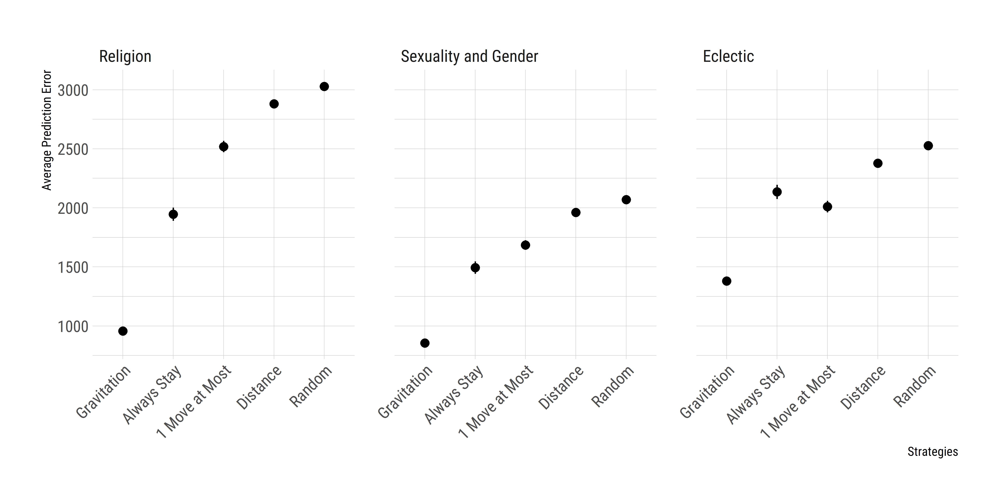
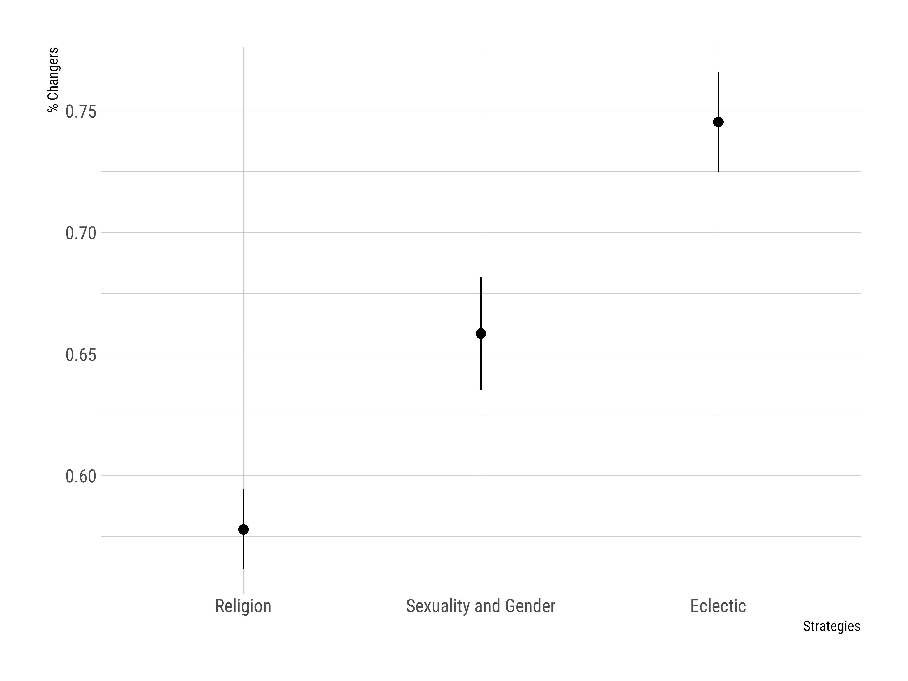

```{r setup, include=FALSE}
knitr::opts_chunk$set(echo = F, message = F, warning = F, fig.align = "center", fig.pos = "!htp")
library(tidyverse)
library(igraph)
library(kableExtra)
library(knitr)
theme_set(theme_bw())
```

[^thanks]: We thank Stephen Vaisey, Tom Wolff, Andrés Castro Araújo, the participants of Worldview Lab at Duke University and Cultural Evolution Lab at University of California at Davis for their helpful comments. The replication files for the article can be found at github.com/NicolasRestrep/landscapes.
[^NR]: Department of Anthropology, University of California, Davis.
[^TK]: Department of Sociology, Duke University.

# Introduction

One widespread metaphor to think about culture is to conceptualize it as a "landscape," where certain cultural objects --personal beliefs, daily practices, or institutional structures-- are closer to some than others. We intuitively know that various positions within those landscapes are highly prevalent: despite their many differences, moral discourses or religious doctrines, across history and social groups, share certain features. We recognize, for instance, that most such doctrines have proscriptions against murder and theft, but fewer against the consumption of animals with cloven hooves. Hence, the landscape metaphor is somewhat literal: once we examine a given cultural space, we recognize the shared features that make certain positions close to one another, and we can tell that there are populated areas and relatively sparse regions.

In this article, we build on this metaphor and explore *personal culture* -- the bits of culture that are manifest in individual beliefs, attitudes, and preferences [@lizardo2017]. We propose an approach to formalizing cultural landscapes using survey data, and argue that this approach is useful for understanding how personal culture is organized. Moreover, we argue that the landscape metaphor is not just useful cartography, but also an analytical tool to explore individual cultural movement.

Using panel data from the National Study of Youth and Religion (NSYR) and simulation studies, we ask whether the organization of cultural landscapes predicts cultural trajectories. We show that cultural landscapes allow us to understand the dynamism of cultural change: people’s probability to change or remain stable varies according to the organization of the landscape. We argue that knowing how people are distributed within cultural positions is informative to predict subsequent states, as some distributions make particular trajectories more or less likely.

The article is structured as follows. We begin by reviewing several common threads within the interdisciplinary efforts to represent culture as a landscape. In the second section, we conceptualize trajectories across cultural landscapes as a Markovian process, where each position in the landscape is associated with a set of transition probabilities. This allows us to specify several generative models of cultural change. We test these models against the empirical data from the NSYR and use simulations to emphasize that these models imply different trajectories depending on the initial topography of the space. We conclude by examining the implications of this exercise, emphasizing the resonance with ideas of duality in cultural sociology.

# Understanding Culture as Landscape

## An Approach for Cartography

The metaphor of culture as landscape is widespread across scientific disciplines, the general idea being that cultural objects, whether they are writing instruments or religions, are defined through the parameters of an underlying landscape [@poulsen2023b; @poulsen2023a]. The first of these parameters is *cardinality*, i.e., the set of total positions within the cultural landscape. The positions are represented as binary strings that denote the presence or absence of certain cultural features -- e.g., 1 for having feature X and 0 for not having feature X. Cardinality allows us to understand the relationships among cultural objects in terms of proximity and distance: fountain pens are somewhat closer to ballpoint pens than they are to chalk, and Zoroastrianism is closer to Christianity than to Buddhism. The second parameter of interest is *topography*, i.e., the relative height of each position in relation to others. This means that a landscape has some volume, determined either by something's perceived utility (you would probably rather take notes with a pencil than charcoal), or mere occupancy (Christianity has currently more adherents in the world than Zoroastrianism).

The popularity of this metaphor is partly because it is useful for understanding several biological and social phenomena. For researchers interested in evolutionary dynamics, the landscape metaphor points towards where potential attractors --i.e., high points in the landscape-- might lie [@falandays2021], an example being the relatively low number of positions occupied within the set of all potential positions in the history of world religions [@biggods2013; @poulsen2023b].[^religion] In studies of social structure, understanding the relationship between individual actors and the positions they occupy in a given cultural landscape is essential [@mark1998; @martin2010]. Several important insights from the sociological study of culture have come from the deceptively simple idea that people who occupy proximate positions in cultural landscapes tend to share other social characteristics as well [@dellaposta2015; @bonikowski2016; @goldberg2011; @baldassarri2014].

[^religion]: In other words, given the almost infinite combination of features a religion could have, it is quite striking that most look broadly similar. Most religions, then, are concentrated in a relatively small area of the cultural landscape.

It is relatively straightforward to formalize these ideas. One strategy is to use binary strings of length $n$, where $n$ refers to the size of elements that constitute the given cultural system. We can use these strings to outline the positions that make up the cultural landscapes [@poulsen2023b; @poulsen2023a]. Going back to the example of religion, we might think about different elements that describe the cultural system of a religion: the institution of monotheism, the belief in an afterlife, or practices of dietary restrictions. The number of these elements would be equal to the length of a string, and the presence or absence of such elements would be denoted by 1s and 0s, respectively. Hence, if we were to characterize Christianity based on the three features just selected, it would occupy the position C = [1, 1, 1] in a three-dimensional space, and this position would imply that all features within the landscape exist in the cultural position of Christianity.

This basic algebraic representation is highly useful, and we can define cardinality and topography easily. In this three-dimensional landscape, the total set of positions would be defined as $2^3 = 8$. Thus, in the general case, the number of elements $n$ can be mapped to $2^n$. Moving from this, we can define the total distance between positions as the absolute value of the Hamming distance between each string of possible cultural positions, calculated as

$$
D_{p_1, p_2} = | p_1 - p_2 |
$$

Cultural positions that are one step away from each other --e.g., $[1, 1, 1]$ and $[1, 1, 0]$-- are considered to be adjacent. We can then represent these positions in a graph, where each vertex represents a position in the landscape, and the edges between vertices capture the adjacency between them. The left panel in Figure 1 depicts the cube emerging from this three-dimensional example.

```{=latex}
\begin{figure}[htp]
\begin{center}
\caption*{Figure 1: Cubes from Three-Dimensional Landscape}
```
```{r fig1, out.width = "100%"}

```
```{=latex}
\end{center}
\end{figure}
```

Having defined the *cardinality* of a landscape, how many positions there are and how they are placed in relation to each other, we can also examine its *topography*. This means the landscape is not flat, but rather has volume. The most famous model for generating these binary representations with unit volumes is called an NK Model [@kauffman1989]. In these models, the central parameter is *ruggedness*, i.e., the correlation between the heights of adjacent positions. A landscape with minimal ruggedness implies that height across positions increases or decreases in expected ways, and the height of one’s current position is quite predictive of what one might expect in adjacent spots. In a maximally rugged landscape, however, the height between positions is relatively unrelated, and one step might lead to a giant increase or a sharp drop. The topography of the landscape is this highly important because it affects how actors or groups navigate it. In spaces with minimal ruggedness, we expect there to be one global peak, and simply walking towards the highest adjacent position is a good strategy to reach that peak. In a rugged landscape, though, such a strategy would likely lead us to be stuck in a local optima. The metaphor of culture as a landscape, then, owes part of its usefulness to being able to capture these dynamics.

## The Social Organization of Personal Culture

Studies of "personal culture," culture manifest in attitudes, beliefs, and preferences [@lizardo2017], have also drawn heavily from the culture as a landscape metaphor. This is perhaps most apparent in the argument that individual differences in personal culture can be captured in an $n$-dimensional "belief space" [@martin2000], much like the religion landscape above. One consistent observation within this literature is that actors' positions generally overlap: we often observe clusters of individuals who share similar positions within the overall belief space [@goldberg2011; @hunzaker2019; @boutyline2022]. Hence, this approach relates individual respondents with positions that have certain frequencies at the group level, where we have a space of positions --*cardinality*-- that are more or less proximate to each other, and that are more or less occupied --*topography*. Tracing such landscapes helps us understand the organization of personal culture: to see how individuals are distributed across positions, and what regions are more populated. 

One underlying principle that governs these various research streams is the notion of *duality*, the idea that actors are defined through groups and groups are defined through actors. Suppose that a landscape consists of various identifiable positions that index the presence or absence of cultural beliefs or institutions. Breiger [-@breiger1974] states that we can use this basic structure to extract two kinds of information: one of "actor-to-actor" relations and one of "group-to-group" relations. As actors cluster around similar regions, to the extent that they share similar cultural positions, we can draw two insights. First, we learn about what kinds of actors end up connected by sharing a cultural position. Second, we can examine the kind of cultural positions that go together because they share the same occupants. Similar to the culture as landscape approach, the principle of duality attempts an understanding of the structure of a given cultural domain.[^duality]

[^duality]: We can follow the thread on Christianity and Zoroastrianism once more: the principle of duality says that the extent to which these two traditions share certain attributes defines how close they are, while we understand the connections between these same attributes as the number of shared ties they possess in the overall landscape. Sociologists exploited these ideas in several ways, most notably by conceptualizing belief systems as the co-occurrence of cultural positions [@bv2017] or positions in a set of potential ordered pairs [@wiley1999]. 

Yet, what does this landscape do? The principle of duality is often used to understand *cultural cartographies*, though the organization of culture might, at least in principle, provide information about *cultural movement*. As Martin [-@martin2000] emphasized before, a picture from a low-orbiting satellite would give us the map, but also help us figure out where the roads are. After all, people live through time, either reproducing or changing the organization of the landscapes. If duality is indeed the underlying principle, these cartographies might not just help us see what culture is like, they might also store "information about [potential] paths that [people will] take" [@leemartin2018, p. 19], or what culture *will* be like. In the next section, we follow this reasoning and formalize a Markovian model of cultural movement in longitudinal data.

# A Markovian Model of Cultural Movement

We propose that the organization of a cultural landscape --i.e., the distribution of cultural positions and the emergent topography at time $t$-- is instrumental to understanding one's cultural trajectory. This trajectory can easily be formalized as a Markov process, where a landscape changes from one state to another. This is effectively an *accounting* of transitions: we observe the number of people occupying a position at each time point, and analyze the movements --say, from position $[1,1,1]$ to position $[1,1,0]$-- within and between landscape positions. Each of these movements is associated with a transition probability; when put together, these probabilities constitute a transition matrix that provides information about the future states of the distribution. With this framework, we can examine whether actors tend to stay put in their initial positions, hover around adjacent locations, or make long-distance jumps within a period of time.

Let us go through an example, and follow a three-feature landscape, like the one we saw above. We have two pieces of information in this Markovian system, the first of which describes the state at $t_0$. In this case, this is a vector $w$ of equal length to the number of positions that constitute the landscape -- each of these positions is occupied by actors.[^features] The second is the matrix of transitions, which stipulates how likely certain movements are among these positions. Imagine that, in its initial state at $t_0$, this is a landscape with two high peaks at [1,1,1] and [0,0,0], with all the other positions only sparsely populated. Our vector of weights $w$ in this hypothetical case would be:

$$
w_0 = (13,5,3,2,4,2,3,14)
$$

[^features]: Remember that (a) each feature is defined with presence (1s) and absence (0s), and (b) since there are 3 unique slots, we have $2^3 = 8$ unique positions.

The right panel of Figure 1 shows this landscape, where the size of the vertices (i.e., the positions) is equal to the number of cultural units (captured in $w_0$) occupying those positions.

Now that we described the landscape, let us imagine that this is a completely stationary system, such that all actors will stay in their positions from one time point to the next. The transition matrix $T$, in this example, will be an $N \times N$ matrix, where $N$ is the number of unique positions. Given the system is stationary, this matrix contains 1s in the diagonal and 0s everywhere else:

$$
T_{8,8} =
\begin{pmatrix}
1 & 0 & 0 & 0 & 0 & 0 & 0 & 0  \\
0 & 1 & 0 & 0 & 0 & 0 & 0 & 0  \\
0 & 0 & 1 & 0 & 0 & 0 & 0 & 0  \\
0 & 0 & 0 & 1 & 0 & 0 & 0 & 0  \\
0 & 0 & 0 & 0 & 1 & 0 & 0 & 0  \\
0 & 0 & 0 & 0 & 0 & 1 & 0 & 0  \\
0 & 0 & 0 & 0 & 0 & 0 & 1 & 0  \\
0 & 0 & 0 & 0 & 0 & 0 & 0 & 1 
\end{pmatrix}
$$

In this system, actors will stay in their positions from one time point to another, and, therefore, have 0 probability of moving anywhere else. In this transition matrix, $T_{i,j}$ represents the probability of moving from position $i$ to position $j$. In our example, an individual located in any given position has 8 possible moves: they can either stay put, or move to the other seven positions. Each of those 8 moves will have a probability associated with it, and these will be encoded in the row associated with the position where the actor is located at time $t$. Given that our system is fully stationary, all probability is concentrated in the diagonal, so we know individuals will stay put.

The transition matrix $T$ gives us one generative model that makes particular predictions about how a cultural landscape should change over time. In the example above, we know with certainty what every actor in the system will do. Hence, we can perfectly predict what the system will look like in a future time-step. In other words, there is only one realization at any future time point that is consistent with that transition matrix: everyone stays where they are. If we take the same initial occupancy weights at $w_0$ as above, the realization matrix for this model would look like this:

$$
R_{8,8} =
\begin{pmatrix}
13 & 0 & 0 & 0 & 0 & 0 & 0 & 0  \\
0 & 5 & 0 & 0 & 0 & 0 & 0 & 0   \\
0 & 0 & 3 & 0 & 0 & 0 & 0 & 0   \\
0 & 0 & 0 & 2 & 0 & 0 & 0 & 0   \\
0 & 0 & 0 & 0 & 4 & 0 & 0 & 0   \\
0 & 0 & 0 & 0 & 0 & 2 & 0 & 0   \\
0 & 0 & 0 & 0 & 0 & 0 & 3 & 0   \\
0 & 0 & 0 & 0 & 0 & 0 & 0 & 14 
\end{pmatrix}
$$

Now, let's consider another model, where all movements between any two positions are equally probable. The transition matrix for this random model would look like this:

$$
T_{8,8} =
\begin{pmatrix}
\frac{1}{8} & ... & ... & ... & ... & ... & ... & \frac{1}{8}           \\
\frac{1}{8} & \frac{1}{8} & ... & ... & ... & ... & ... & \frac{1}{8}   \\
\frac{1}{8} & ... & \frac{1}{8} & ... & ... & ... & ... & \frac{1}{8}   \\
\frac{1}{8} & ... & ... & \frac{1}{8} & ... & ... & ... & \frac{1}{8}   \\
\frac{1}{8} & ... & ... & ... & \frac{1}{8} & ... & ... & \frac{1}{8}   \\
\frac{1}{8} & ... & ... & ... & ... & \frac{1}{8} & ... & \frac{1}{8}   \\
\frac{1}{8} & ... & ... & ... & ... & ... & \frac{1}{8} & \frac{1}{8}   \\
\frac{1}{8} & ... & ... & ... & ... & ... & ... & \frac{1}{8} 
\end{pmatrix}
$$

In this case, we can think of each row as representing a fairly weighted 8-sided die. We roll the die as many times as there are occupants in the corresponding position at $t_0$, and record the new positions. For instance, if we get the number 4 twice for the first row, we record 2 in the cell $R_{1,4}$. This would mean that 2 individuals moved from position 1 = [0,0,0] to position 4 = [0,1,1]. Here, we have *many* realization matrices that are compatible with the transition matrix. Here is one example:

```{tikz, tikz-ex, fig.ext = 'png', cache=TRUE}
\usetikzlibrary{arrows}
\usetikzlibrary{decorations.markings}
\tikzstyle{int}=[draw, minimum size=4em]
\tikzset{->-/.style={decoration={
            markings,
            mark=at position #1 with {\arrow{>}}},postaction={decorate}}}
\begin{tikzpicture}[node distance=4cm, auto]
    \node [int] (a) {REALIZATION};
    \node        (b) [right of=a,shift={(1.0cm,0mm)}]{$\begin{pmatrix}
3 & 1 & 2 & 0 & 2 & 1 & 4 & 0  \\
0 & 1 & 1 & 0 & 1 & 0 & 2 & 0   \\
0 & 1 & 1 & 0 & 0 & 0 & 1 & 0    \\
0 & 1 & 0 & 1 & 0 & 0 & 0 & 0  \\
0 & 0 & 0 & 2 & 1 & 0 & 1 & 0   \\
0 & 0 & 0 & 0 & 1 & 0 & 1 & 0   \\
0 & 2 & 0 & 0 & 0 & 0 & 0 & 1  \\
0 & 3 & 1 & 2 & 2 & 3 & 2 & 1
\end{pmatrix}$};
    \node        (c) [left of=a, shift={(-1.2cm,0mm)}]{$\begin{pmatrix}
\frac{1}{8} & ... & ... & ... & ... & ... & ... & \frac{1}{8}  \\
\frac{1}{8} & \frac{1}{8} & ... & ... & ... & ... & ... & \frac{1}{8}   \\
\frac{1}{8} & ... & \frac{1}{8} & ... & ... & ... & ... & \frac{1}{8}    \\
\frac{1}{8} & ... & ... & \frac{1}{8} & ... & ... & ... & \frac{1}{8}   \\
\frac{1}{8} & ... & ... & ... & \frac{1}{8} & ... & ... & \frac{1}{8}   \\
\frac{1}{8} & ... & ... & ... & ... & \frac{1}{8} & ... & \frac{1}{8}    \\
\frac{1}{8} & ... & ... & ... & ... & ... & \frac{1}{8} & \frac{1}{8}   \\
\frac{1}{8} & ... & ... & ... & ... & ... & ... & \frac{1}{8} 
\end{pmatrix}$};
\draw[dashed, ->=0.5] (c) --(a);   
\draw[dashed, ->=0.5] (a) --(b);  
\end{tikzpicture}
```

In the diagonal, we see how many actors stay in their original positions. Excluding the diagonal, the column sums capture the amount of inflow towards a particular position. Conversely, the row sums capture how many people leave a given location in the landscape. Hence, the realization matrix allows us to chart the inflows to, and outflows from, a particular position.

## Adjudicating Between Models of Movement

Of course, we can only observe the realized transitions in the empirical context. How can we know the underlying generative model? We can exploit the fact that certain realization matrices will be more compatible with some transition matrices than others. One straightforward procedure to do this is to compare multiple models using the sum of the absolute differences between the empirical matrix and the realization matrix predicted by a given movement model:

$$
\text{Prediction Error} = \sum|E-R|
$$

where $E$ refers to the empirical matrix while $R$ refers to the realization matrix.

Lower differences would indicate a better fit between the specified movement model and the observed data. Let's go back to the example above. Imagine our empirical matrix looks more similar to the realization matrix from the random model. Say we want to compare two movement models that might have produced these data. The first is the totally random model we saw above. The second is perhaps a more specific one, which we will call *move at most one*. It states that moves that imply one step or fewer (like staying) have equal probability, while those that imply longer distances have zero probability. This is what the transition matrix for this model would look like:

$$
T_{8,8} =
\begin{pmatrix}
\frac{1}{4} & \frac{1}{4} & \frac{1}{4} & 0 & \frac{1}{4} & 0 & 0 & 0  \\
\frac{1}{4} & \frac{1}{4} & 0 & \frac{1}{4} & 0 & \frac{1}{4} & 0 & 0  \\
\frac{1}{4} & 0 & \frac{1}{4} & \frac{1}{4} & 0 & 0 & \frac{1}{4} & 0  \\
0 & \frac{1}{4} & \frac{1}{4} & \frac{1}{4} & 0 & 0 & 0 & \frac{1}{4}  \\
\frac{1}{4} & 0 & 0 & 0 & \frac{1}{4} & \frac{1}{4} & \frac{1}{4} & 0  \\
0 & \frac{1}{4} & 0 & 0 & \frac{1}{4} & \frac{1}{4} & 0 & \frac{1}{4}  \\
0 & 0 & \frac{1}{4} & 0 & \frac{1}{4} & 0 & \frac{1}{4} & \frac{1}{4}  \\
0 & 0 & 0 & \frac{1}{4} & 0 & \frac{1}{4} & \frac{1}{4} & \frac{1}{4} 
\end{pmatrix}
$$

We can compare the empirical matrix with the realization matrices produced by the proposed models. Given that there is stochasticity involved in moving from the transition matrix to the realization matrix, we want to iterate over this process several times to build a reliable picture of what model of movement is more compatible with the data we have observed. We can, for instance, compare 100 realization matrices from each model with our empirical matrix, and then take the median prediction error. Subsequently, we can iterate over these process several times to get a distribution of median prediction errors. Figure 2 shows these distribution for our current example:

```{=latex}
\begin{figure}[htp]
\begin{center}
\caption*{Figure 2: Adjudication Example}
```
```{r fig2, out.width = "100%"}

```
```{=latex}
\end{center}
\footnotesize{\textit{Notes:} The figure depicts the simulated median prediction errors for two generative models.}
\end{figure}
```

Here, the points represent the mean prediction error and the lines cover the range between the 25th and 75th percentiles. We notice that, even though we have a relatively few agents in our example (*N* = 46), our method favors the movement model that actually reproduced the data. The differences, however, are not that big, which suggests that our capacity to tell apart these two different models --conditional on the observed data-- is limited. Nonetheless, even in this minimal example, we see that our method has the capacity to adjudicate between two models of movement, pointing towards the more plausible data-generating process.

# An Analysis of Cultural Movement

We now turn to our empirical exercise. In this section, we test several generative models to see the extent to which the structure of a cultural landscape is predictive of subsequent movement. We do this in four steps. First, we propose several models of movement that we derived from theoretical expectations. We then describe three landscapes that provide insights into our expectations. Third, we analyze the predictions from five generative models against the empirical data. In the last step, we turn to simulation models to explore the implications of these predictions.

## Generative Models of Cultural Movement

We assess how different models of movement capture the transitions observed in three landscapes of personal culture. We compare five models. The first two are models that are either fully agnostic or fully deterministic: the *random* model and the *always stay* model. These models do not incorporate any information about the current state of the landscape or its topology; either all movements are equally likely or no one moves, regardless of how the landscape is organized. We also examine three models that consider some information about the topology of the landscape. The first is *move at most one*, which assigns equal probability to staying in one's initial position or moving to one of the adjacent locations. This is a less stringent version of *always stay*, and it assumes that actors are likely to stay put in a given region of the cultural landscape. The models that incorporate the most information about the landscape are the *distance-based* model and the *gravitational* model. For the former, the probability of movement to each position is inversely proportional to the squared distance between positions. The latter is similar, but it incorporates the topology of the landscape fully: simply, the probability of moving to a position is proportional to the current occupancy of that position divided by the squared distance from the current location.

The set of generative movement models we examine is based on current work on change and stability in personal culture [@kiley2020; @lersch2023; @vaisey2016]. These studies state that, while the current occupancy of positions is a reliable predictor of whether actors will stay there, there is ample evidence of random and erratic movement as well. Therefore, the *always stay* and *random* models are extreme and highly implausible abstractions of these findings. That being said, the relative accuracy of these models of movement should tell us something about which one of these two processes --stasis or randomness-- is more informative about a given landscape. The other models add further assumptions: move at most one is derived from Kiley's [-@kiley2023] work, which shows that, when respondents move, they tend to stay put within particular regions of the cultural landscape. The distance-based model is a more explicit way of modeling this process, making it so that long-distance transitions are not impossible but increasingly more unlikely. Finally, the gravitational model of movement combines several ideas. It emphasizes the notion of conformity -- that more populous positions are both more likely to keep their current occupants and to attract newcomers [@parsons1951; @falandays2021]. However, it also captures the idea that the distance between positions mediates this process. In other words, a move to a new position, regardless of how well populated it currently is, becomes less likely if such a move would entail traversing long distances across the cultural landscape.

## Data and Analytic Strategy

To adjudicate the relative explanatory power of these generative models, we use survey data from the National Study of Youth and Religion (NSYR), a longitudinal and nationally representative survey of adolescents and early adults in the United States. The first wave of the NSYR was fielded in 2002 and 2003 with 3,370 respondents aged 13 to 17. In approximately two-year intervals, the NSYR conducted three subsequent surveys (2005, 2007-2018, and 2012-2013), which allows us to follow the trajectories of personal culture among adolescents and early adults -- a demographic that tends to display some durable change [@kiley2020; @guhin2021; @keskinturk2022]. Moreover, the questions touch on a wide array of subjects, from religion to abstract questions about morality. This allows us to build different cultural landscapes with varying topographies, and examine how agents move across them.[^waves]

[^waves]: Since most of these questions had been included as of Wave 2, we use Waves 2, 3, and 4 in the upcoming analyses. To mitigate confusion, we refer to these waves as Time 1, Time 2, and Time 3.

We analyze movement across three landscapes with widely different features. The first is made up of seven questions around religion -- e.g., whether respondents believe in angels, miracles, and the afterlife (N = 1,684). The second features seven items as well, this time related to gender and sexuality. These encompass questions about whether mothers should work or unmarried sex is permissible (N = 1,134). The last landscape consists of an eclectic set of items with equal length, ranging from moral relativism to the respondents' belief in God (N = 1,432). Our choice of these landscapes is deliberate: we wanted to build cultural landscapes that have different topographical features. The sexuality and gender landscape, for instance, has one highly populated peak, with other positions only sparsely occupied. This resembles what scholars of "rugged landscapes" call a *mount Fuji* terrain: a landscape dominated by one global peak. The religion landscape, in turn, has two highly populated yet distant peaks. Finally, the eclectic terrain is quite disorganized, lacking clear peaks. Thus, the latter is the most rugged of the three. Table 1 documents the full set of items.

```{r}
table <- tibble(
  Landscape = c("Religion",
                "Religion",
                "Religion",
                "Religion",
                "Religion",
                "Religion",
                "Religion",
                "Gender and Sexuality",
                "Gender and Sexuality",
                "Gender and Sexuality",
                "Gender and Sexuality",
                "Gender and Sexuality",
                "Gender and Sexuality",
                "Gender and Sexuality",
                "Eclectic",
                "Eclectic",
                "Eclectic",
                "Eclectic",
                "Eclectic",
                "Eclectic",
                "Eclectic"),
  Item = c("aftrlife", "angels", "astrolgy", "demons", "god", "miracles", "reincar",
           "abstain1", "divrceok", "mandecid", "menwrk", "unmarsex", "wommar", "wrkngmom",
           "god", "spiritua", "wrldorig", "moralrel", "viewrel", "relprvte", "okayconv"),
  Label = c("Belief in Afterlife",
            "Belief in Angels",
            "Belief in Astrology",
            "Belief in Demons",
            "Belief in God",
            "Belief in Miracles",
            "Belief in Reincarnation",
            "Waiting for Sex Until Marriage",
            "Couples Should Stick to Marriage",
            "Man Make Important Decisions",
            "Man Earns the Living",
            "Unmarried People Having Sex",
            "Women's Life Without Marriage",
            "A Working Mom's Relationship with Child",
            "Belief in God",
            "Spiritual But Not Religious",
            "The Origins of the World",
            "Moral Relativism",
            "The Views About the Truth of Religion",
            "Religion: Private or Public",
            "Converting Others to Religion"))

kbl(
  table,
  booktabs = TRUE,
  caption = "The Items Used for the Analyses",
  linesep = "") |>
  kable_styling(font_size = 11, full_width = TRUE,
                latex_options = c("scale_down", "hold_position")) |>
  pack_rows("Landscape 1", 
            1, 7) |> 
  pack_rows("Landscape 2", 
            8, 14) |> 
  pack_rows("Landscape 3", 
            15, 21) |>
  column_spec(column = 1, width = "5cm") |> 
  column_spec(column = 2, width = "2cm")

```

We chose these landscapes precisely because we are interested in how the features of the space might be associated with different patterns of movement. Our ultimate goal is to try to understand whether the layout of a given cultural landscape is associated with certain trajectories. Figure 3 depicts the layout and topography of these cultural landscapes.

```{=latex}
\begin{figure}[htp]
\begin{center}
\caption*{Figure 3: Cultural Landscapes}
```
```{r fig3, out.width = "100%"}

```
```{=latex}
\end{center}
\end{figure}
```

## Empirical Results

For each of the three cultural landscapes, we examine the relative explanatory power of the five movement models outlined above. In other words, we assess how likely each model --with their respective transition matrices-- is to have generated the transitions we see in our empirical data. Figure 4 depicts the distribution of prediction errors for each movement model for each landscape.

```{=latex}
\begin{figure}[htp]
\begin{center}
\caption*{Figure 4: Prediction Errors from Empirical Models}
```
```{r fig4, out.width = "100%"}

```
```{=latex}
\end{center}
\end{figure}
```

The first general trend we notice is that the gravitational model is the one that best captures the patterns of movement in the data, across all landscapes. Second, we see that the random movement and distance-based models miss the mark the most often. Incidentally, the high inaccuracy of the latter gives us an indication that knowing the current occupancy of each position is important for understanding what kind of transitions people will make.

The greater explanatory power of the gravitational model is perhaps expected given that it is the model that incorporates the most information. The gravitational model has more parameters --it takes into account information about the distance between positions *and* the current occupancies-- and, therefore, is the most flexible among our five candidates. Therefore, the gravitational model can make vastly different predictions depending on the structure of the initial landscape. It is thus useful to examine the second most informative model. This is equivalent of asking, "what other model does the gravitational model most resemble in a given landscape?"

We see that the gravitational model seems to have a different relationship with the other models, and this varies across landscapes. In the Religion landscape, we find that the second most explanatory model is *Always Stay*. This hints at the fact that stasis is a dominant pattern in this system: most people are staying in their original positions. This gives us an additional sense that gravitation can in fact predict stasis: it would be the most likely outcome in a system where there are highly occupied positions away from each other. Their gravitational pull is nullified by distance and by the countervailing forces of other attractors -- stasis, then, is the compromise. As we mentioned above, this is precisely the topography of the Religion landscape.

For the Sexuality and Gender and the Eclectic landscapes, we see that the *Move One at Most* is the second most appropriate model. This means that gravitation is predicting either stability or small movements around the original position. However, note the relationship between *Move One at Most* and *Always Stay* in each landscape. For the Sexuality and Gender, both models are quite close in their prediction errors. This means that, while there are short-distance transitions, stasis is also a common pattern. For the Eclectic landscape, in turn, these models have quite different explanatory powers. This means that gravitation here does really predict considerable movement, and betting that people will stay in their original position is not as reliable.

Our central finding is that the gravitational model is the most predictive, but this model implies different patterns of movement depending on the layout and topography of the initial landscape. Knowing the current organization of a landscape --the distance between positions and how these are occupied-- is thus highly useful for predicting how agents will move. But the kind of patterns of movement we expect depends on the organization of the landscape itself. 

## Simulation Studies

To further reinforce this argument, we can examine simulations where we start with the initial organization of each of our landscapes constructed using the NSYR and let the system develop according to a gravitational model of movement. Figure 5 provides one such simulated development: we simulate data as if it was produced by a gravitational model, and examine the explanatory power of each of our five models. For these simulations, we run 100 iterations and take the median prediction error. Then, we repeat this process 50 times.

```{=latex}
\begin{figure}[htp]
\begin{center}
\caption*{Figure 5: Prediction Errors from Simulated Models}
```
```{r fig5, out.width = "100%"}

```
```{=latex}
\end{center}
\end{figure}
```

Again, we see similar patterns, suggesting that, even if the gravitational model is the "true" data generating process of these transitions, we should expect to see different patterns of movement in each landscape. In a landscape dominated by one peak, like the Sexuality and Gender landscape, we should expect to see a lot of people staying at that peak, but also some inflow towards that global attractor. Gravitation, then, resembles a combination of *Always Stay* and *Move at Most One*. In a landscape with a few peaks that are far apart, like the Religion one, we expect stasis, as these highly populated and distant peaks retain their population. Gravitation here looks like *Always Stay*. Finally, in a relatively disorganized and flat landscape, like our eclectic terrain, we expect more movement, mostly made up of short-distance transitions.

Notice, however, that there are differences between our empirical and simulated results. While the overall general trends are similar, there are points of divergence. For example, in the Sexuality and Gender landscape, now *Always Stay* is a more adequate model than *Move at Most One*, though the differences remain small. In turn, for the Eclectic landscape, the difference in accuracy between *Move at Most One* and *Always Stay* is reduced. This differences imply that the gravitational model --while adequate-- is not capturing all the trajectories in the empirical data. This is unsurprising; we should not expect any model to capture all the patterns in the data. But the specific ways in which models fail can be informative. In general, it seems like in the empirical data we are seeing more stasis than the purely gravitational model would predict. 

An important implication of this exercise is that the layout of the landscape not only affords certain patterns of movement, but also a certain level of *overall* movement. Figure 6 shows the percentage of agents that moved in our simulations for each of the landscapes.

```{=latex}
\begin{figure}[htp]
\begin{center}
\caption*{Figure 6: The Percent of Changers in Simulated Results}
```
```{r fig6, out.width = "100%"}

```
```{=latex}
\end{center}
\end{figure}
```

Again, we notice that the multi-polar landscape, like the Religion one, experiences the least amount of movement. It is followed by the single-peak landscape, where there is stasis but also considerable inflow towards the global high point. Lastly, the most rugged landscape also exhibits the highest proportion of overall movement. The topography, then, gives us information about the transitions and the overall proportion of movement we should expect in a landscape.

# Discussion

In this article, we argue that the common metaphor of culture as a landscape is not only useful for understanding how culture is organized --i.e., as a cartographic exercise-- but also for analyzing how people move across cultural positions. We note that different disciplinary efforts have converged in certain algebraic representations of cultural landscapes, where binary strings represent the presence or absence of a certain set of elements that define the positions of the landscape. These landscapes have two central features: cardinality and topography. The former refers to our ability to enumerate the positions that constitute a space and to know how close or far they are from each other. The latter, in turn, is concerned with features of the positions themselves, like how efficacious they are or --in our case-- how well-populated they are. Echoing Martin [-@martin2000], we contend that capturing the layout of these landscapes is also helpful for understanding how people will move across them.

To test this idea, we examined trajectories of cultural movement in the NSYR. We argued that understanding movement across landscapes of personal culture can be captured by a Markovian process where each position in the landscape is associated with a set of transition probabilities. By varying these transition probabilities, it is possible to build generative models of movement that are explicit about the kind of trajectories we expect to see in a given landscape. We then compared the predictions made by different generative models with the observed empirical data in order to adjudicate their explanatory power. We found that a gravitational model --one that calculates transition probabilities according to the occupancy of positions and the distance between them-- is the most adequate model for explaining the observed trajectories. 

However, we found that the kind of trajectories that such a gravitational model would predict depend heavily on the initial layout of the landscape. This is the central insight of our analysis. Both in our empirical analyses and simulations, we saw that the organization of the landscapes is informative for understanding the patterns of movement that we should expect to see. In general, we noticed that the "ruggedness" of the landscape is particularly relevant. In the eclectic landscape, for instance, we noticed a high proportion of movement, consisting mostly of short transitions. The Sexuality and Gender landscape, with its one global peak, exhibited a lot of stasis but also many agents moving towards that main attractor. The Religion landscape, in turn, had two peaks that effectively nullified each other, resulting in a higher proportion of individuals staying in their original positions. Hence, our analyses suggest that how culture is organized at one point is instrumental to understanding subsequent development of culture at the population level.

## The Duality of What?

One important implication of this study extends to the debates around the notion of duality in general [@breiger1974] and the duality of people and cultural beliefs in particular [@bv2017; @martin2000]. Sociologists have used  the idea of duality to understand belief systems, cultural schemas, and affiliation networks. Most of these studies, however, have examined these cultural structures as *static*. The benefits of this approach notwithstanding, understanding cultural trajectories requires us to reconceptualize cultural landscapes as evolving and dynamic set of cultural positions. This means that relying on one approach or the other --individuals connected by the pieces of culture they share or cultural elements linked by the individuals that internalize them-- might provide only a partial understanding of cultural systems. In fact, the framework of duality also shapes how we should expect the system to look like in the future: how agents are distributed across the landscape makes up the topology of the landscape, while at the same time the topology of the landscape is informative for understanding how those agents will move.

## The Movement of What?

Measuring the dynamics of cultural landscapes is quite appealing, though the price is two strong assumptions. First, the model assumes that the processes of cultural change and stability depend on the public opinion field, meaning that the social distribution of ideas is central to understanding belief dynamics. Yet, two conflicting cultural models can explain this expectation: it might be that actors learn this structure early on, and the landscape changes through the replacement of old actors with the new ones [@vaisey2016], or certain period effects might push people to places with high volume through processes of conformity [@dellaposta2015]. We remain agnostic about either explanation, though it is important to note that we expect the distribution of positions has a say in predicting *both* change and stability over the survey period. 

Second, algebraic representations suffer from important measurement problems. First, the assumption of binary positions is restrictive, as it often involves arbitrary cutoffs that eliminate the original variance. Second, the list of the number of elements $N$ that defines the dimensions of our space is unlikely to be exhaustive. Third, and perhaps most importantly, the survey responses can become too volatile or uncertain to reliably infer one's position in a belief space, given that measurement error might affect the overall distribution [@alwin2007; @zaller1992].

The measurement problem is a trade-off between recovering *true* states or ensuring that we get the benefits of being able to locate positions spatially. Sociologists often build latent state models that associate cultural profiles not to a specific position in the landscape, but rather to a set of probabilities that produce a given set of responses [@kiley2023]. This allows us to bypass potential measurement errors resulting from a number of factors [@alwin1991; @ansolabehere2008], as well as ensuring that the potential movement we observe is not due to errors. This fends off uncertainty, but comes with several costs. For instance, given that latent states are defined qualitatively, we cannot understand the directionality or distance of trajectories. In other words, we do not know what transitions are large or small, and whether certain latent states are closer to others. In this sense, our proposal for measuring cultural landscapes comes with important caveats, though we believe that the gains might be useful nonetheless.

## Moving Forward

We argued that culture as landscape comes with two benefits: (a) understanding culture as a set of evolving and dynamic positions and (b) the extension of static cultural representations to dynamic models of movement. This framework, however, extends to multiple units and relations. First, the same formal representation applies to organizational ecologies, where the principle of duality dictates, once again, the dual relationship between organizational actors and field-specific ties. Understanding how fields organize around specific features and the resulting topography might help us predict stability and change in organizational networks. Second, the framework of culture as landscape is highly instrumental to understanding historical emergence of cultural attractors, given that new religions, cultural movements, or political institutions often redefine the given landscape. This, in turn, facilitates questions around whether certain features replicate over time, or whether new features start defining multiple clusters. Finally, culture as landscape allows us to ask cross-cultural questions as to the structural similarities among different groups, particularly with regard to the organization of religion, political ideologies, or moral frameworks. We hope that researchers find this approach useful in their own work.

# References
